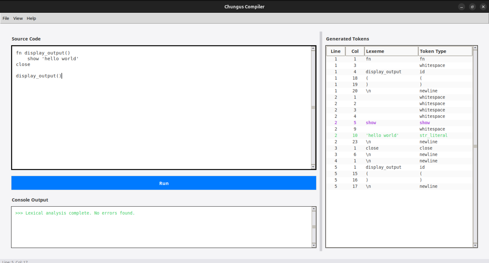

# CHUNGUS Language
A clean, minimal, general programming language.

<p align="center">
  
</p>

## Quick start
1. Create and activate a venv
   - macOS / Linux:
     ```sh
     python3 -m venv .venv
     source .venv/bin/activate
     ```
   - Windows (PowerShell):
     ```ps
     python -m venv .venv
     .venv\Scripts\Activate.ps1
     ```
2. Install dependencies
   - Base:
     ```sh
     pip install -r requirements.txt
     ```
   - Dev:
     ```sh
     pip install -r requirements.txt
     ```

## Running the project

- GUI
  ```sh
  python -m src.main
  ```

- Lexer CLI
  ```sh
  python -m src.lexer
  ```

- Parser CLI
  ```sh
  python -m src.syntax
  ```

Docker
- Build image (uses [Dockerfile](Dockerfile))
  ```sh
  docker build -t chg-compiler .
  ```

- Run lexer CLI
  ```sh
  docker run --rm -it chg-compiler python -m src.lexer
  ```

- Run parser CLI
  ```sh
  docker run --rm -it chg-compiler python -m src.syntax
  ```

- GUI in Docker
  ```sh
  *Currently not supported
  ```
Testing
- Run all tests:
  ```sh
  pytest -q
  ```
- Run a single test file:
  ```sh
  pytest -q test/lexer/test_lexer_tokens.py
  ```

Linting
- Run flake8 over the codebase:
  ```sh
  flake8 .
  ```
  Project config lives in [.flake8](.flake8).


## How to contribute in project?
- Create branch, run tests locally, open PR.
- Follow flake8 style rules; run `flake8` before PR.