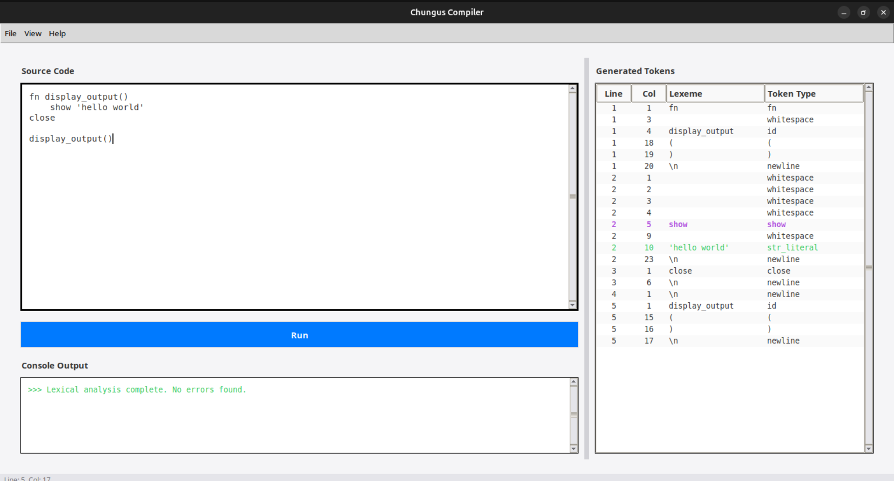

# CHUNGUS Language
A clean, minimal, general programming language.

<p align="center">
  
</p>

## Quick start
1. Create and activate a venv
   - macOS / Linux:
     ```sh
     python3 -m venv .venv
     source .venv/bin/activate
     ```
   - Windows (PowerShell):
     ```ps
     python -m venv .venv
     .venv\Scripts\Activate.ps1
     ```
2. Install dependencies
   - Windows (PowerShell):
     ```sh
      python -m pip install pip-tools
      python -m piptools sync requirements-dev.txt
     ```
   - macOS / Linux:
     ```sh
      python3 -m pip install pip-tools
      python3 -m piptools sync requirements-dev.txt
     ```

## Running the project

### Full Pipeline (Compile & Run)

**Recommended for most users** - runs all compilation phases and executes the program:

- macOS / Linux: 
  ```sh
  python3 -m src <file.chg>
  python3 -m src samples/program1.chg      # Example
  ```
- Windows
  ```sh
  python -m src <file.chg>
  python -m src samples\program1.chg
  ```

This will:
1. Tokenize the source (Lexer)
2. Parse and generate AST (Syntax)
3. Type check and validate (Semantic)
4. Generate C code in `output/` (Codegen)
5. Compile and execute (Runtime)

### Current Language/Runtime Notes

- `read` is assignment-only (e.g. `x = read;`) and is not parsed as a general expression.
- Runtime `read` is dynamic:
  - integer text (e.g. `42`) → `int`
  - floating text (e.g. `3.14`) → `float`
  - otherwise → `string`
- `for ... in range(...)` supports:
  - `range(stop)`
  - `range(start, stop)`
  - `range(start, stop, step)`
- `range(..., step=0)` is guarded at runtime with an error message.
- GUI execution has a timeout for long-running programs and reports partial output on timeout.

### Individual Phase CLIs

Run specific compilation phases for debugging or testing:

- **GUI** (All phases with visual interface)
  - macOS / Linux: `python3 -m src.main`
  - Windows: `python -m src.main`

- **Lexer** (Tokenization only)
  - macOS / Linux: `python3 -m src.lexer [file.chg]`
  - Windows: `python -m src.lexer [file.chg]`
  - Uses `input_lexer.chg` if no file specified

- **Parser** (Syntax analysis only)
  - macOS / Linux: `python3 -m src.syntax [file.chg]`
  - Windows: `python -m src.syntax [file.chg]`
  - Uses `input_syntax.chg` if no file specified

- **Semantic** (Type checking only)
  - macOS / Linux: `python3 -m src.semantic [file.chg]`
  - Windows: `python -m src.semantic [file.chg]`
  - Uses `input_semantic.chg` if no file specified

- **Codegen** (Generate C code only, no execution)
  - macOS / Linux: `python3 -m src.codegen [file.chg]`
  - Windows: `python -m src.codegen [file.chg]`
  - Uses `input_codegen.chg` if no file specified
  - Output saved to `output/`

- **Runtime** (Compile and run C code)
  - macOS / Linux: `python3 -m src.runtime <file.c>`
  - Windows: `python -m src.runtime <file.c>`
  - Compiles C with CHUNGUS runtime library and executes

### Docker

- Build image (uses [Dockerfile](Dockerfile))
  ```sh
  docker build -t chg-compiler .
  ```

- Run full pipeline
  ```sh
  docker run --rm -it chg-compiler python -m src samples/program1.chg
  ```

- Run individual phase CLIs
  ```sh
  docker run --rm -it chg-compiler python -m src.lexer
  docker run --rm -it chg-compiler python -m src.syntax
  ```

- GUI in Docker
  ```sh
  *Currently not supported
  ```

### ### Testing

- Run all tests:
  ```sh
  pytest -q
  ```
- Run a single test file:
  ```sh
  pytest -q test/lexer/test_lexer_tokens.py
  ```

### ### Linting

- Run flake8 over the codebase:
  ```sh
  flake8 .
  ```
  Project config lives in [.flake8](.flake8).

### C Runtime Build & Testing

The CHUNGUS runtime library is in `src/runtime/`. Use the Makefile for testing:

- Build runtime library
  ```sh
  cd src/runtime && make
  ```

- Build and test runtime
  ```sh
  cd src/runtime && make test
  ```

- Clean up compiled files
  ```sh
  cd src/runtime && make clean
  ```

- Check for memory leaks (requires valgrind)
  ```sh
  valgrind --leak-check=full ./output/program
  ```

### Output Directory

All generated files are saved to `output/`:
- `*.c` - Generated C source files
- `*` (no extension) - Compiled executables

Clean output directory:
```sh
rm -rf output/
```

## How to contribute in project?
- Create branch, run tests locally, open PR.
- Follow flake8 style rules; run `flake8` before PR.